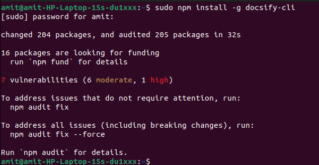
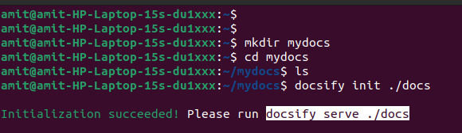
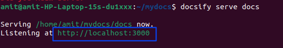
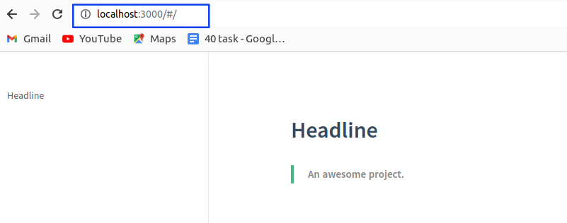
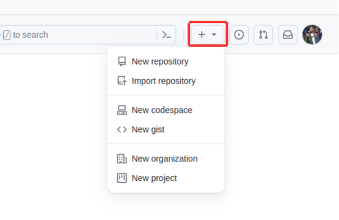
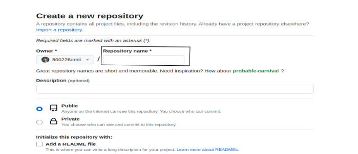
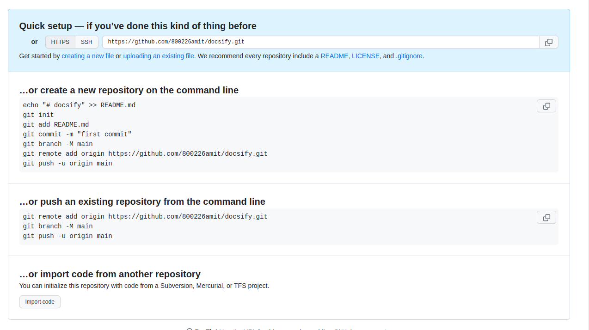
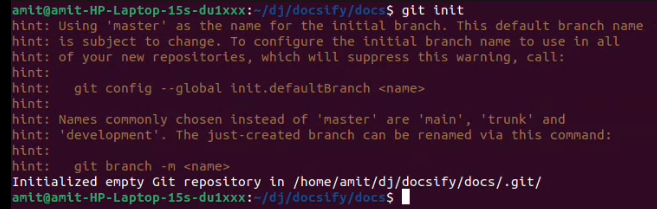

# Docsify


>
> Docsify is a popular lightweight documentation generator that can help you create beautiful and responsive documentation websites from markdown files. To use Docsify in Ubuntu, you'll need to follow these steps


## Install Node.js and npm:

#### Why use Node.js?
> Installing Node.js and npm is essential for providing the necessary runtime environment, dependency management, and command-line tools required to work effectively with Docsify and other modern web development tools.

```
sudo apt update
sudo apt install nodejs npm
```

## Step 1: Install Docsify globally.

> Install Docsify globally on the system using npm. a package manager for Node.js packages, or modules if you like.
>


```
sudo npm install -g docsify-cli
```

> 
>

## Step 2: Create a documentation directory.


```
mdkir mydocs
```


```
cd mydocs
```


## Step 3: Initialise Docsify
> Initialise docsify in the directory using the following command:
```
 docsify init ./docs
```



## Step 4: Preview the documentation
> To preview your documentation, run the following command inside your main documentation directory:

>This given URL you need to copy and run in your browser and click Enter.

```
docsify serve docs
```





## Output of the Preview

#### Pest your URL in your browser.




# gitHub


## Step-5

>For making a repository, click on "New repository".



## Step-6 

> Enter your repository name and give permission to the public.



## Step-7 

> Here are some commands to copy and paste one by one.



## Step-8 

command:

```
git init

```
>   The git init command creates a new git repository. It can be used to convert an existing, unversioned project to a Git repository or initialise a new, empty repository.



## Step-9


 **In this step, you need to follow the command that is provided by the github repository.**


 ****The git init command is used to initialize a new Git repository in a directory. When you run git init in a directory, it sets up the necessary files and directories that Git uses to manage version control for your project.****

> 
```
git init
```

>  **The git add command is used to stage changes for commit in a Git repository. When you make changes to your files, such as editing or adding new content to README.md, you need to use git add to inform Git that you want to include these changes in the next commit.**


```
git add README.md

```
> **The command git commit -m "first commit" is used to create a new commit in your Git repository with a commit message describing the changes you've made**

```
git commit -m "first commit"

```

> **The git branch -M main command is used to rename the default branch of your Git repository. This command is commonly used to change the name of the default branch from master to main, which aligns with more inclusive terminology.**

```
git branch -M main

```
>> **The git remote add origin command is used to connect your local Git repository with a remote repository on a platform like GitHub. The origin in this command is typically a short name used to refer to the remote repository.**

```
git remote add origin https://github.com/800226amit/docsify.git

```

>> **The git push -u origin main command is used to push the local commits in your repository's main branch to the remote repository specified by the origin remote. The -u flag is used to set up tracking between the local main branch and the remote main branch, making it easier to push and pull changes in the future.**

```
git push -u orgin main

```


## update and Change


When you change something in your document and update it, then run the following command:


```
git remote add origin https://github.com/800226amit/docsify.git

```


```
git branch -M main 

```


```
git push -u orgin main

```


# The End     Thank you
