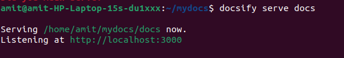
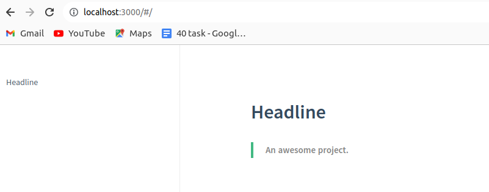
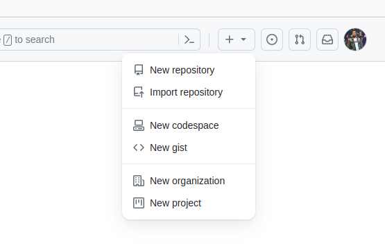
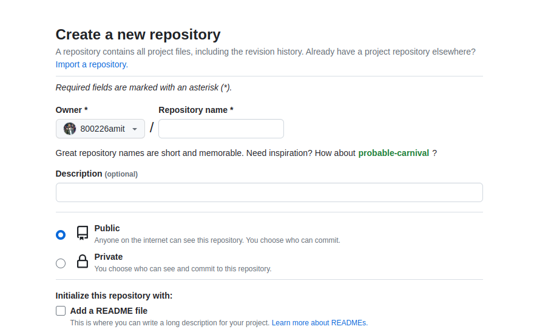
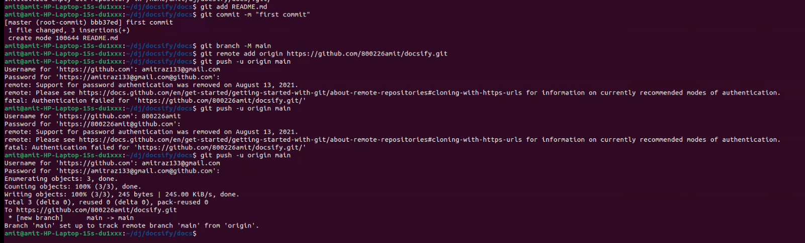

# Docsify

## Step-1: Install docsify globally

> Install docsify globally on the system using npm.  a package manager for Node.js packages, or modules if you like.
>

#### Command : sudo npm install -g docsify-cli

> 
>

## Step-2: Create a Documentation directory

####  mdkir mydocs
####  cd mydocs

## Step-3: Initialise docsify  
> Initialise docsify in the directory using the following command: docsify init ./docs

## Step-4: preview the documentation
> To preview your documentation, run the following command inside your main documentation directory

## Output of Preview

# gitHub

## Step-5

> For Makeing repository click on top "New repository".

## Step-6 

> Enter your repository name and give permission to the public.

## Step-7 

> 

## Step-8 

## Step-9

